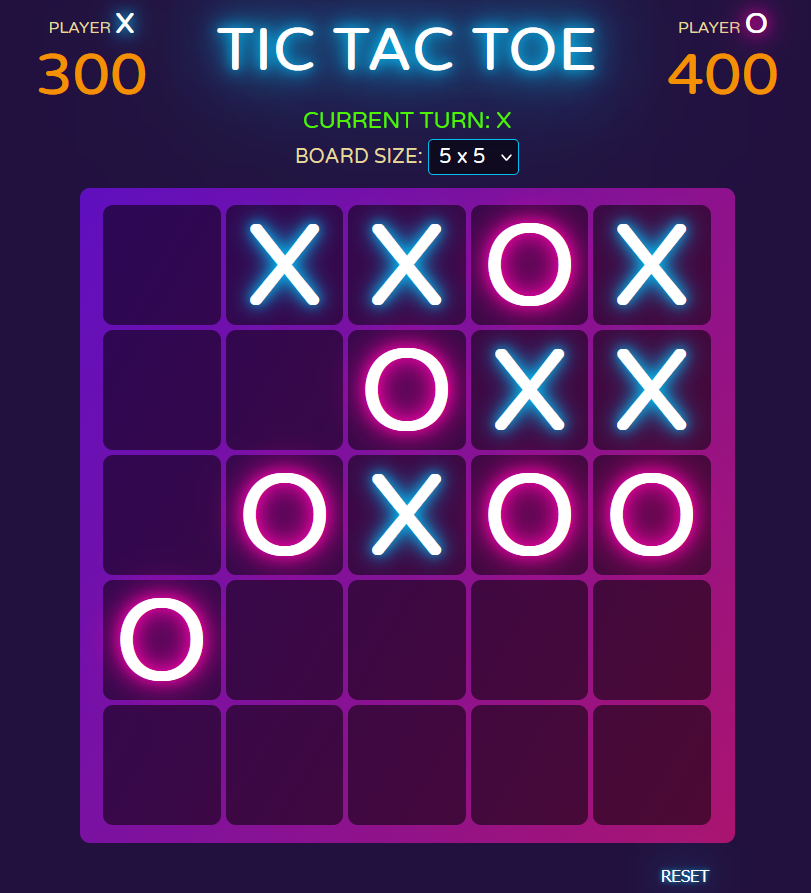

# Welcome to Tic Tac Toe

This is an implementation of the classic game, written in TypeScript with plain HTML and CSS — no
framework, no bundler, no game library. It started as a small 3x3 game I made on a holiday evening for
my own fun, and then I asked myself why it should be limited only to 3x3, and it turned into a
relatively serious project.

The game supports 2-player mode on any square board from **3x3 up to 8x8**, which you pick from the UI.
Instead of a hardcoded list of winning combinations, the board is turned into a matrix of `0` and `1`
and the lines are **calculated**, so the same code works on any dimension. Players earn points for
every line of 3 or more in any direction — horizontally, vertically and on both diagonals — and longer
lines are worth more. When the board is full, the higher score wins, and the winner gets a firework. 🎆

### Demo



### Features

- 2-player local mode, X against O
- Selectable board size, from 3x3 to 8x8
- Scoring engine based on matrix rotations, works on any dimension
- Live score board and a current-turn indicator
- Winner detection with a modal and a canvas firework (and a draw state)
- `RESET` at any time, and `PLAY AGAIN` straight from the winner modal
- Switchable win rule: play until the board is full, or classic sudden death
- Written with the `Module` and `Singleton` design patterns, no framework

### How the scoring works

Each player's selected cells are painted into an `n x n` matrix of `0` and `1`. Every row is joined
into a string and split on `'0'`, so each remaining group of `1`s is a line — and any group of 3 or
more scores `length * 100`. To count the columns and the two diagonals, the same matrix is rotated by
90, 45 and -45 degrees and fed to the very same counting function.

That is why a line of 3 gives 300 and a line of 5 gives 500, on a 3x3 board or a 20x20 one. It is
explained step by step, with animations, in [part 3 of the article series](<docs/How to make an TIC TAC TOE game - part 3.md>).

### Getting Started

1. Clone the repository: `git clone https://github.com/panahi-projects/tic-toc-toe.git`
2. Navigate to the project directory: `cd tic-toc-toe`
3. Install the packages: `npm install`
4. Run the application: `npm run dev`
5. Open your browser and navigate to http://localhost:3000 to see the application in action.

The port is `3000` and it is hardcoded in `server.ts` / `server.js`. There are no environment
variables to set.

### Available scripts

The scripts are as follows:

- `npm run dev` — `concurrently` runs `tsc -w`, compiles `server.ts` once, and starts `nodemon`
- `npm start` — `node server.js`, it serves whatever is already compiled into `build/`
- `npm run build-dist` — compiles `src/` into `build/` once
- `npm test` — a placeholder, there are no tests yet

### Project structure

```
public/            served as the web root
├── index.html     the shell: title, turn indicator, board size selector, score boards
├── style.css      all the styles, including the modal and the firework canvas
└── assets/        images and the animated explanations used in the articles
src/
├── index.ts       entry point, builds a board and wires the size selector
├── interfaces/    every type of the project in one file
├── store/         gameStats (contests & scores) and moveStats (moves & turn) singletons
└── utils/
    ├── global.ts       CreateElement() DOM factory, generateID()
    ├── playground.ts   builds the grid, handles the clicks, decides the winner
    ├── gamePlay.ts     places a symbol, advances the turn indicator
    ├── scoring.ts      the matrix + rotations scoring engine
    ├── winnerModal.ts  the winner / draw modal
    └── firework.ts     the canvas particle animation
build/             compiled output — committed, and what the browser actually loads
docs/              the 4-part article series about building this game
server.js          Express static server with livereload (compiled from server.ts)
```

### Configuration

A few constants you can change:

- `DEFAULT_GRID_SIZE` in `src/index.ts` — the board size selected on load (default `5`)
- `SUDDEN_DEATH` in `src/utils/playground.ts` — set it to `true` for the classic rule, where the game
  stops at the first winning line instead of running until the board is full
- `WINNING_SCORE` in `src/utils/playground.ts` — how many points count as a win in sudden death.
  `300` means a line of 3, `500` means a line of 5

### Notes if you want to contribute

- **`build/` is committed on purpose.** `public/index.html` loads `../build/index.js` as a native ES
  module, so the browser runs the compiled output directly. After changing anything in `src/`, run the
  build and commit the regenerated `build/` along with your source change.
- **Imports must end with `.js`**, even though the files are `.ts` — for example
  `import { CreateElement } from './global.js'`. There is no bundler here, the browser resolves those
  paths itself and `tsc` leaves them exactly as you typed them.
- `watch:2` is `tsc server.ts` without `-w`, so it compiles once at startup. Also, passing a filename
  to `tsc` makes it ignore `tsconfig.json`, which is why `server.js` looks older-style than the rest of
  the output. If you edit `server.ts`, restart `npm run dev`.
- `body-parser` is required by `server.js` but is not listed in `package.json` — it currently resolves
  because `express` brings it along. If you touch the dependencies, install it explicitly.

### Known limitations

- Cells are a fixed ~100px, so the **board grows** instead of shrinking. From 7x7 the board gets wider
  than the space the score boards sit in, and the `PLAYER X` / `PLAYER O` titles start to overlap its
  corners. Making it responsive means scaling the cell width, the padding and the symbol font size
  together.
- Nothing is persisted. A page reload starts a fresh session.
- No tests.

### The article series

I wrote the whole story of this project as a 4-part tutorial, in [docs/](docs/):

1. [Part 1](<docs/How to make an TIC TAC TOE game - part 1.md>) — the 3x3 game in plain JavaScript, the UI and the web server
2. [Part 2](<docs/How to make an TIC TAC TOE game - part 2.md>) — migrating to TypeScript, the `Module` and `Singleton` patterns, a playable N×N board
3. [Part 3](<docs/How to make an TIC TAC TOE game - part 3.md>) — the scoring engine: the matrix and the 90 / 45 / -45 degree rotations
4. [Part 4](<docs/How to make an TIC TAC TOE game - part 4.md>) — winner detection, the firework, the modal, and the board size selector

### Node version

This project was started with Node v18.16.1, and it also builds and runs on Node v24.

### What's next

- 1-player mode against the computer — the `TType` type already says `'Mankind' | 'AI'`, so the door is
  open
- a responsive board for mobile screens
- showing the game history that `GameStats` already collects but never displays

### Acknowledgments

Many thanks to the creators of Express.js and Node.js for making such amazing tools available to the
developer community.
